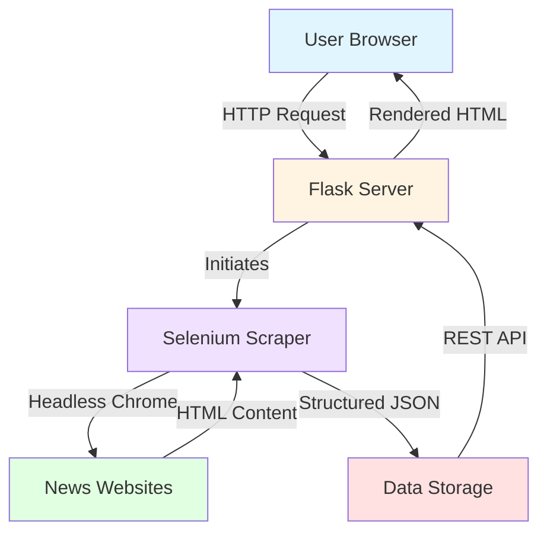

# 📰 Chronos News Aggregator

<div align="center">


**A powerful, real-time news aggregation platform that automatically collects and displays the latest headlines from multiple global news sources in one unified interface.**

[🎯 Problem](#-the-problem) • [🚀 How It Works](#-how-it-works) • [✨ Features](#-features) • [💻 Installation](#-installation) • [📖 Usage](#-usage-guide) • [🛠️ Configuration](#️-configuration)


</div>

https://github.com/user-attachments/assets/058cc93a-6746-4a52-9a95-49749f2bce7c

---


## 🎯 The Problem

### Why Chronos Exists

In today's information-saturated world, staying well-informed presents several challenges:

| Challenge | Impact |
|-----------|--------|
| 🌊 **Information Overload** | Too many news websites to monitor individually |
| ⏰ **Time Waste** | Visiting 7+ news sites daily consumes precious hours |
| 📡 **Missed Breaking News** | Manual checking means delays in critical updates |
| 🎨 **Fragmented Experience** | Each website has different layouts and navigation |
| 🚫 **Ad Clutter** | News sites are overwhelmed with ads and popups |
| 🔀 **No Centralization** | No single dashboard to compare perspectives |

### The Chronos Solution

**Chronos News Aggregator** eliminates these pain points:

✅ **Parallel Scraping** - Fetches from 7+ sources simultaneously  
✅ **Clean Interface** - Ad-free, distraction-free reading experience  
✅ **Auto-Refresh** - Updates every 15 minutes automatically  
✅ **Unified Design** - Consistent UX across all news sources  
✅ **One-Click Access** - Direct links to full articles  
✅ **Background Processing** - Non-blocking architecture for smooth performance  

---

## 🚀 How It Works

### System Architecture



### Technical Flow

```
┌─────────────────────────────────────────────────────────────┐
│  STEP 1: INITIALIZATION                                     │
│  Flask server starts → Background scraper launches          │
└─────────────────────┬───────────────────────────────────────┘
                      │
                      ▼
┌─────────────────────────────────────────────────────────────┐
│  STEP 2: WEB SCRAPING                                       │
│  Selenium opens headless Chrome → Visits each news site     │
└─────────────────────┬───────────────────────────────────────┘
                      │
                      ▼
┌─────────────────────────────────────────────────────────────┐
│  STEP 3: DATA EXTRACTION                                    │
│  CSS selectors grab headlines → Links extracted             │
└─────────────────────┬───────────────────────────────────────┘
                      │
                      ▼
┌─────────────────────────────────────────────────────────────┐
│  STEP 4: STORAGE                                            │
│  Data saved as JSON → Cached in memory                      │
└─────────────────────┬───────────────────────────────────────┘
                      │
                      ▼
┌─────────────────────────────────────────────────────────────┐
│  STEP 5: DISPLAY                                            │
│  Frontend fetches via API → Renders clean UI cards          │
└─────────────────────────────────────────────────────────────┘
```

### Data Pipeline

```
📰 News Sites → 🤖 Selenium → 📄 JSON → 🌐 Flask API → 💻 Browser UI
    (BBC,         (Headless    (news_     (RESTful      (Clean
     CNN,          Chrome)      data.json) endpoints)     cards)
     etc.)
```

---

## ✨ Features

### 🎯 Core Capabilities

<table>
<tr>
<td width="50%">

**🔄 Multi-Source Aggregation**
- Scrapes 7 major news sources
- Parallel processing for speed
- Diverse global perspectives

</td>
<td width="50%">

**⚡ Real-Time Updates**
- Auto-refresh every 15 minutes
- Manual refresh on demand
- Never miss breaking news

</td>
</tr>
<tr>
<td>

**🎨 Clean Interface**
- Ad-free reading experience
- Minimalist card design
- Responsive across devices

</td>
<td>

**🚀 High Performance**
- Background processing
- Cached data for speed
- Non-blocking architecture

</td>
</tr>
<tr>
<td>

**🔒 Security First**
- XSS protection
- HTML escaping
- Safe external links

</td>
<td>

**🛠️ Developer Friendly**
- RESTful API
- Clean code structure
- Easy to extend

</td>
</tr>
</table>

### 📊 Technical Highlights

- **Headless Browser Automation** - Chrome runs invisibly in background
- **RESTful API Design** - Clean `/api/news` endpoint for programmatic access
- **Responsive Design** - Mobile, tablet, and desktop optimized
- **Graceful Degradation** - Continues working if some sources fail
- **Smart Caching** - Local JSON storage for instant page loads

---

## 📡 News Sources

<div align="center">

| Source | Coverage | Region | Status | Articles |
|:------:|:--------:|:------:|:------:|:--------:|
|  | International | 🇬🇧 UK | ✅ Active | 5 |
|  | International | 🇺🇸 USA | ✅ Active | 5 |
|  | International | 🇶🇦 Qatar | ✅ Active | 5 |
|  | International | 🇺🇸 USA | ✅ Active | 5 |
|  | National | 🇵🇰 Pakistan | ⚠️ Intermittent | 0-5 |
|  | National | 🇵🇰 Pakistan | ✅ Active | 5 |
|  | International | 🇺🇸 USA | ✅ Active | 5 |

</div>

> **Note:** Express Tribune may occasionally show 0 articles due to website access restrictions or structural changes.

---

## 💻 Installation

### Prerequisites

Ensure you have the following installed:

```bash
# Python 3.8 or higher
python --version  # or python3 --version

# Google Chrome browser
chrome --version  # or google-chrome --version

# pip package manager
pip --version
```

### 🚀 Quick Start

#### Windows

```bash
# Clone the repository
git clone https://github.com/yourusername/chronos-news-aggregator.git
cd chronos-news-aggregator

# Run the automated start script
start.bat
```

#### macOS / Linux

```bash
# Clone the repository
git clone https://github.com/yourusername/chronos-news-aggregator.git
cd chronos-news-aggregator

# Make script executable and run
chmod +x start.sh
./start.sh
```

### 📦 Manual Installation

<details>
<summary><b>Click to expand detailed manual installation steps</b></summary>

#### Step 1: Create Project Directory

```bash
mkdir chronos-news-aggregator
cd chronos-news-aggregator
```

#### Step 2: Set Up Virtual Environment (Recommended)

```bash
# Create virtual environment
python -m venv venv

# Activate on Windows
venv\Scripts\activate

# Activate on macOS/Linux
source venv/bin/activate
```

#### Step 3: Install Dependencies

```bash
pip install flask selenium
```

Or use requirements.txt:

```bash
pip install -r requirements.txt
```

#### Step 4: Create Project Structure

```
chronos-news-aggregator/
├── app.py                 # Flask server
├── news_scraper.py        # Selenium scraper
├── requirements.txt       # Python dependencies
├── templates/
│   └── index.html        # Main HTML template
├── static/
│   ├── css/
│   │   └── style.css     # Styling
│   └── js/
│       └── app.js        # Frontend logic
└── news_data.json        # Cached news data (auto-generated)
```

#### Step 5: Launch Application

```bash
python app.py
```

#### Step 6: Access in Browser

Navigate to: **`http://127.0.0.1:5000`**

</details>

---

### 🎯 Daily Workflow

| Action | Steps |
|--------|-------|
| **View News** | Scroll through all sources, click headlines to read full articles |
| **Refresh News** | Click the refresh button (⟳) in the top-right corner |
| **Auto-Updates** | Application automatically refreshes every 15 minutes |
| **Check Timestamp** | View "Last updated" time in the header |

### ⌨️ Keyboard Shortcuts

| Shortcut | Action |
|----------|--------|
| `Ctrl/Cmd + R` | Reload entire page |
| `Click headline` | Open full article in new tab |
| `Scroll` | Navigate through news sources |

---

## 🛠️ Configuration

### 🔧 Adding Custom News Sources

Edit `news_scraper.py` to add your own sources:

```python
def scrape_custom_source(self):
    """Scrape your custom news source"""
    print("Scraping Custom Source...")
    try:
        self.driver.get("https://your-news-site.com")
        time.sleep(3)
        
        articles = []
        # Update CSS selector to match your target website
        elements = self.driver.find_elements(By.CSS_SELECTOR, 'article.news-item h2 a')[:10]
        
        for element in elements:
            title = element.text.strip()
            link = element.get_attribute('href')
            
            if title and link:
                articles.append({'title': title, 'link': link})
                if len(articles) >= 5:
                    break
        
        self.all_news['Custom Source'] = articles
        print(f"  Custom Source: Found {len(articles)} articles")
        
    except Exception as e:
        print(f"  Failed to scrape Custom Source: {e}")
        self.all_news['Custom Source'] = []
```

Then add the method call to `scrape_all()`:


### ⏰ Adjusting Auto-Refresh Interval

Edit `static/js/app.js` (around line 235):

```javascript
// Auto-refresh every X minutes (default: 15)
setInterval(() => {
    if (!AppState.isScraping) {
        refreshNews();
    }
}, 15 * 60 * 1000);  // Change 15 to your desired minutes
```

### 🌐 Changing Server Port

Edit `app.py` (last line):

```python
if __name__ == '__main__':
    app.run(
        debug=True,
        host='0.0.0.0',
        port=5000,  # Change to your desired port (e.g., 8080, 3000)
        use_reloader=False
    )
```

---

## 🔧 Troubleshooting

### Common Issues

<details>
<summary><b>❌ No news articles appearing</b></summary>

**Possible Causes:**
- Initial scraping not yet complete
- Network connectivity issues
- Website structure changes

**Solutions:**
1. Wait 60 seconds after starting the app
2. Click the refresh button manually
3. Check console for error messages
4. Verify internet connection

</details>

<details>
<summary><b>❌ ChromeDriver error</b></summary>

**Error Message:** `selenium.common.exceptions.WebDriverException`

**Solution:**
1. Ensure Google Chrome is installed
2. Update Chrome to latest version
3. Selenium will auto-download matching ChromeDriver

</details>

<details>
<summary><b>❌ Port 5000 already in use</b></summary>

**Error Message:** `OSError: [Errno 48] Address already in use`

**Solutions:**

**Windows:**
```bash
# Find process using port 5000
netstat -ano | findstr :5000

# Kill the process (replace PID)
taskkill /PID <PID> /F
```

**macOS/Linux:**
```bash
# Find and kill process
lsof -ti:5000 | xargs kill -9

# Or change port in app.py
```

</details>

<details>
<summary><b>❌ Express Tribune shows 0 articles</b></summary>

**Cause:** Website may be blocking automated access or structure changed

**Solutions:**
1. This is normal and can be ignored
2. Replace with another Pakistani news source
3. Check website's robots.txt policy

</details>

### Enable Debug Mode

For detailed error logging, edit `app.py`:

```python
import logging

# Add at the top of app.py
logging.basicConfig(
    level=logging.DEBUG,
    format='%(asctime)s - %(name)s - %(levelname)s - %(message)s'
)
```

### Test Scraper Independently

```bash
# Run scraper without Flask server
python news_scraper.py

# Check generated news_data.json
cat news_data.json  # macOS/Linux
type news_data.json  # Windows
```

---

## 📈 Performance Metrics

<div align="center">

| Metric | Value | Details |
|--------|-------|---------|
| ⏱️ **Initial Scrape** | 30-60 sec | First-time data collection |
| 🔄 **Refresh Time** | 20-40 sec | Subsequent updates |
| 📄 **Page Load** | < 1 sec | Cached data serving |
| 💾 **Memory Usage** | ~150 MB | During scraping |
| 🖥️ **CPU (Idle)** | < 5% | Background state |
| 🖥️ **CPU (Scraping)** | 15-25% | Active scraping |
| 🌐 **Network** | ~10 MB | Per scrape cycle |
| 📊 **Total Sources** | 7 | Active news sites |

</div>

---

## 🗺️ Roadmap

### ✅ Version 1.1 (Current)

- [x] 7 international news sources
- [x] Real-time scraping with Selenium
- [x] Auto-refresh every 15 minutes
- [x] Responsive card-based design
- [x] RESTful API endpoint

### 📅 Version 1.3 (Planned)

- [ ] 👤 User accounts and preferences
- [ ] 🔖 Save/bookmark favorite articles
- [ ] 📧 Email digest subscriptions
- [ ] ✏️ Custom source selection
- [ ] 📄 Export articles to PDF

### 🔮 Version 2.0 (Future Vision)

- [ ] 📱 Mobile app (React Native)
- [ ] 🔔 Push notifications for breaking news
- [ ] 🧠 ML-based personalized recommendations
- [ ] 🌍 Multi-language support
- [ ] 📴 Offline reading mode

---

## 🤝 Contributing

Contributions make the open-source community thrive! Here's how you can help:

### How to Contribute

1. **🍴 Fork the Repository**
   ```bash
   gh repo fork yourusername/chronos-news-aggregator
   ```

2. **🌿 Create a Feature Branch**
   ```bash
   git checkout -b feature/AmazingFeature
   ```

3. **💻 Make Your Changes**
   - Write clean, documented code
   - Follow PEP 8 style guidelines
   - Test thoroughly

4. **✅ Commit Your Changes**
   ```bash
   git commit -m 'Add: AmazingFeature description'
   ```

5. **🚀 Push to Branch**
   ```bash
   git push origin feature/AmazingFeature
   ```

6. **🔃 Open Pull Request**
   - Describe your changes clearly
   - Reference any related issues
   - Wait for review

### Contribution Guidelines

- ✅ Follow PEP 8 Python style guide
- ✅ Add comments for complex logic
- ✅ Update documentation for new features
- ✅ Test across different browsers
- ✅ Respect website terms of service
- ✅ No breaking changes without discussion

### Areas for Contribution

- 🐛 Bug fixes and error handling
- ✨ New features from roadmap
- 📰 Additional news source integrations
- 🎨 UI/UX improvements
- 📚 Documentation enhancements
- 🌍 Internationalization

---

## 🙏 Acknowledgments

### 🛠️ Built With

- **[Flask](https://flask.palletsprojects.com/)** - Lightweight Python web framework
- **[Selenium](https://www.selenium.dev/)** - Browser automation tool
- **[Chrome WebDriver](https://chromedriver.chromium.org/)** - Headless browser engine
- **[Python](https://www.python.org/)** - Core programming language

### 💡 Inspired By

- Modern news aggregators (Feedly, Flipboard, Google News)
- Minimalist design principles
- The open-source community

### 🌟 Special Thanks

- All news organizations for providing quality journalism
- Python and Flask developer communities
- Contributors and users of this project
- Everyone supporting open-source software

---

## 📞 Support & Contact

### 🆘 Getting Help

- **🐛 Bug Reports:** [Open an Issue](https://github.com/yourusername/chronos-news-aggregator/issues)
- **💬 Questions:** [Start a Discussion](https://github.com/yourusername/chronos-news-aggregator/discussions)
- **📧 Email:** support@chronos-news.example.com
- **📖 Documentation:** Check this README and inline code comments

### 📚 Documentation

- **REST API:** `GET /api/news` - Returns JSON with all news data
- **Code Comments:** Comprehensive inline documentation
- **This README:** Complete usage and setup guide

---

## 🌟 Show Your Support

If you found this project helpful:

<div align="center">

⭐ **Star this repository** on GitHub  
🐛 **Report bugs** and suggest features  
🔄 **Share** with friends and colleagues  
📝 **Write** a blog post about your experience  
☕ **Buy me a coffee** to support development  

[](https://github.com/yourusername/chronos-news-aggregator)
[](https://github.com/yourusername/chronos-news-aggregator/fork)

</div>

---

## 📊 Project Statistics

<div align="center">

```
📝 Lines of Code:        1,200+
📰 News Sources:         7
🔌 API Endpoints:        2  
🎯 CSS Selectors:        25+
⚡ JS Functions:         15+
🐍 Python Classes:       2
💾 Total Size:           ~150 KB
⏱️ Initial Load:         30-60 seconds
🔄 Refresh Time:         20-40 seconds
```

</div>

---

## 🎓 Learning Resources

### 📚 For Beginners

- [Python Official Tutorial](https://docs.python.org/3/tutorial/)
- [Flask Mega-Tutorial](https://blog.miguelgrinberg.com/post/the-flask-mega-tutorial-part-i-hello-world)
- [Selenium with Python](https://selenium-python.readthedocs.io/)

### 🕷️ Web Scraping

- [Beautiful Soup vs Selenium](https://www.scrapingbee.com/blog/selenium-vs-beautifulsoup/)
- [CSS Selectors Guide](https://www.w3schools.com/cssref/css_selectors.php)
- [Handling Dynamic Content](https://www.selenium.dev/documentation/webdriver/)

### 🌐 Flask Development

- [Flask Documentation](https://flask.palletsprojects.com/)
- [Flask RESTful APIs](https://flask-restful.readthedocs.io/)
- [Flask Best Practices](https://flask.palletsprojects.com/en/2.3.x/patterns/)

---

## ✅ Pre-Launch Checklist

Before running the application, ensure:

- [x] Python 3.8 or higher installed
- [x] Google Chrome browser installed
- [x] Flask installed (`pip install flask`)
- [x] Selenium installed (`pip install selenium`)
- [x] All project files in correct directory structure
- [x] Port 5000 is available (or configured to different port)
- [x] Stable internet connection active
- [x] Virtual environment activated (recommended)

---

<div align="center">

### 🚀 Ready to Launch?

```bash
python app.py
```

**Visit:** [http://127.0.0.1:5000](http://127.0.0.1:5000)
